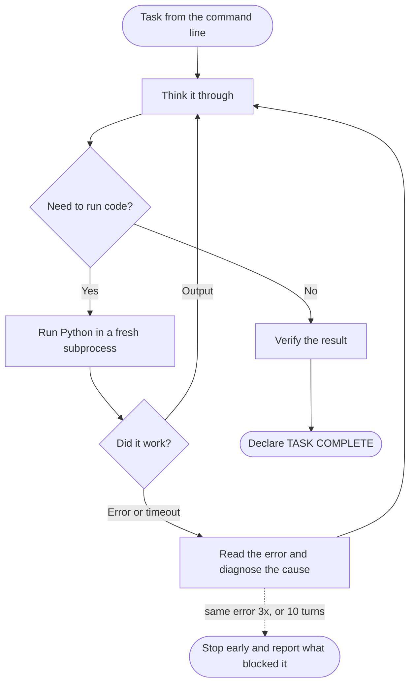

# Basic-Agent

A self-contained AI agent built from scratch, one step at a time, to understand
what an "AI agent" actually is under the hood.

## The loop, at a glance



Every arrow back to **Think** is the agent seeing what its last action actually
did — including its own failures — and choosing the next one.

## What this is

`sovereign-agent/agent.py` is a single-file AI agent. You give it a task on the
command line; it reasons about the task, writes and runs Python code to work on
it, reads what happened, and keeps going until it has an answer.

It is deliberately not a framework. Every moving part is written out in one
readable file so you can see exactly where the "agency" comes from — no hidden
orchestration, no library doing the interesting part for you.

## The core idea

A chatbot is one request and one response. An agent is:

**model + loop + tools + memory**

- **Model** — decides what to do next.
- **Tools** — let it actually do things, not just describe them.
- **Loop** — run the model, execute whatever tool it asked for, feed the result
  back, run it again. Repeat until it stops asking for tools.
- **Memory** — the growing list of messages. Each turn is appended, so the model
  sees everything that has happened so far.

That's the whole trick. The autonomy people mean when they say "agent" is the
loop: the model gets to see the consequences of its own actions and choose the
next one. Take the loop away and you have a chatbot again.

## What it can do

The agent was built in six stages, each one still visible in the file:

1. **A single API call.** Send a task to Claude, print the reply. The baseline
   to build on.
2. **The agent loop, with a `run_python` tool.** Claude can write Python, have
   it executed, and see the real output. Each call runs in a fresh subprocess
   with a 30-second timeout, so a crash or a hang can't take down the agent.
3. **Structured tracing.** Every event — the task, the reasoning, each tool call
   and its result, the final answer — is written to a timestamped JSON Lines
   file under `traces/`, and mirrored to the terminal as it happens.
4. **Extended thinking.** Claude's chain of thought is captured before each
   action, so you can watch it reason and re-read that reasoning later. The
   thinking is also replayed back to the model each turn, so it builds on what
   it already worked out.
5. **Self-correction.** Errors, tracebacks, and timeouts are handed back to the
   model flagged as failures. It reads the actual error, diagnoses it, and tries
   a fix — with retries labelled in the trace so the recovery is easy to follow.
   Guards keep it honest: it stops after 3 identical failures in a row or 10
   turns, and reports what it was stuck on rather than spinning. Unexpected
   errors are recorded as trace events instead of crashing the program.
6. **An explicit stopping condition.** The agent works until the task is
   genuinely done, verifies it, and declares `TASK COMPLETE` with a short
   summary of what it accomplished. Every run ends with a labelled outcome —
   *completed*, *stopped early*, *ended without a marker*, or *errored* — so a
   real success is distinguishable from a run that merely stopped talking.

> **Note:** `run_python` executes model-written code on your machine with your
> permissions and no sandbox. Fine for local experimenting; don't point it at
> anything you care about.

## Running it

```bash
cd sovereign-agent

# One-time setup
python3 -m venv .venv
.venv/bin/pip install -r requirements.txt

# Add your key
echo "ANTHROPIC_API_KEY=sk-ant-..." > .env
```

Then give it a task:

```bash
.venv/bin/python agent.py "Find the roots of 3x^2 - 7x + 2, then verify them by substituting back"
```

You'll see the reasoning, the code, and the results scroll past as it works. The
last line prints the path to that run's trace file.

## Project structure

```
sovereign-agent/
├── agent.py          # the entire agent — config, system prompt, tool, trace, loop
├── requirements.txt  # anthropic, python-dotenv
├── .env              # your API key (gitignored)
└── traces/           # one JSONL file per run (gitignored)
```

Everything is at the top of `agent.py` and easy to change: the model, the token
and turn limits, the thinking budget, and the system prompt that defines how the
agent approaches a problem.

Read a past run back with:

```bash
jq . sovereign-agent/traces/run-*.jsonl
```
